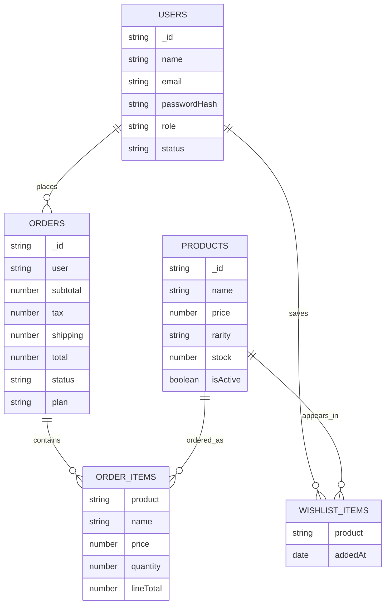

# Lab Assignment 1 Documentation

## 1. Assignment Title
Lab Assignment 1: Choose Your Project Website and Define Its Database Structure

## 2. Project Website Selection
Project Name: ScoopCraft Pints

Project Type: E-commerce Website (Custom Ice Cream Pint Store)

### Why This Website Was Chosen
- It supports real-world e-commerce use cases: product browsing, cart, checkout, orders, and account management.
- It includes role-based management (Admin/Manager/Customer).
- It requires structured, related data, making it suitable for database design practice.
- It allows extension features such as wishlist, order tracking, and SEO settings.

### Core Functional Modules
- User authentication (sign up, sign in, sign out)
- Product catalog and product details
- Custom flavour selection (3-flavour and 4-flavour options)
- Cart and checkout
- Wishlist
- Order creation and tracking
- Admin dashboard (products, users, orders, SEO)

## 3. Technology Stack
- Backend: Node.js, Express.js
- Frontend: EJS templates, HTML, CSS, JavaScript
- Database: MongoDB
- ODM: Mongoose
- Session/Auth: express-session + custom auth middleware

## 4. Database Structure (MongoDB)
Database Name (default): scoopcraft-store

The system uses the following primary collections:
- products
- users
- orders
- seosettings

## 5. Collection Definitions

### 5.1 products Collection
Purpose: Stores all pint product records and their flavour options.

Main fields:
- name: String (required)
- price: Number (required, min 0)
- rarity: String (required)
- category: String (optional)
- image: String (required)
- description: String (required)
- shortDescription: String
- isActive: Boolean (default true)
- stock: Number (default 50)
- flavourOptions: Array of embedded objects
  - name: String (required)
  - note: String
  - color: String (hex color)
- SEO fields:
  - seoTitle: String
  - seoDescription: String
  - seoKeywords: String
  - metaRobots: String
  - canonicalUrl: String
- timestamps: createdAt, updatedAt

Index:
- Text index on name, description, category, seoKeywords

### 5.2 users Collection
Purpose: Stores customer/admin/manager accounts and wishlist references.

Main fields:
- name: String (required)
- email: String (required, unique, lowercase)
- passwordHash: String (required)
- role: Enum [Admin, Customer, Manager] (default Customer)
- status: Enum [Active, Inactive] (default Active)
- phone: String
- address: String
- wishlist: Array of embedded objects
  - product: ObjectId ref -> products
  - addedAt: Date
- timestamps: createdAt, updatedAt

### 5.3 orders Collection
Purpose: Stores placed orders including customer snapshot, order items, totals, and tracking.

Main fields:
- user: ObjectId ref -> users (nullable for guest-like flows)
- customer: Embedded object
  - name: String (required)
  - email: String (required)
  - phone: String (required)
  - address: String (required)
- items: Array of embedded objects (required, at least 1 item)
  - product: ObjectId ref -> products
  - name: String (required)
  - price: Number (required)
  - quantity: Number (required, min 1)
  - lineTotal: Number (required)
  - selectedFlavours: [String]
  - scoopCount: Number
- subtotal: Number (required)
- tax: Number (required)
- shipping: Number (required)
- discount: Number (required, default 0)
- total: Number (required)
- plan: Enum [one-time, subscription]
- couponCode: String
- status: Enum [Placed, Processing, Delivered] (default Placed)
- trackingHistory: Array of embedded objects
  - status: Enum [Placed, Processing, Delivered]
  - note: String
  - updatedAt: Date
- timestamps: createdAt, updatedAt

### 5.4 seosettings Collection
Purpose: Stores site-level SEO configuration used globally in page rendering.

Main fields:
- siteTitle: String
- titleSeparator: String
- metaDescription: String
- metaKeywords: String
- canonicalBaseUrl: String
- robots: String
- ogImage: String
- twitterCard: String
- timestamps: createdAt, updatedAt

## 6. Entity Relationships
- users -> wishlist[].product -> products._id
- orders.user -> users._id
- orders.items[].product -> products._id

Relationship summary:
- One user can wishlist many products.
- One user can place many orders.
- One order contains many order items.
- One product can appear in many order items and many wishlists.

## 7. High-Level ER Diagram (Logical)

## 8. Notes and Assumptions
- Categories are currently optional and de-emphasized in UI.
- Wishlist supports both JavaScript and non-JavaScript form flows.
- SEO exists at two levels:
  - global (seosettings)
  - per product (products SEO fields)

## 9. Conclusion
ScoopCraft Pints is an appropriate assignment website because it demonstrates practical web commerce architecture and a normalized document-based MongoDB design with clear entity boundaries, embedded subdocuments, and ObjectId relationships.
